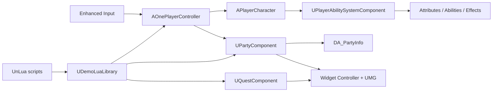

# UE5 Action RPG Technical Demo

**Unreal Engine 5.6 · C++ · Blueprint · Gameplay Ability System · Enhanced Input · UMG · UnLua**

[中文文档](#中文) · [English Documentation](#english)

<a id="中文"></a>

## 中文

这是一个以 C++ 承担底层玩法、Blueprint 负责资产配置与画面表现的 UE5 动作角色扮演 Demo。项目围绕 Gameplay Ability System 构建战斗和属性，以组件管理队伍、任务、背包与经验，并通过事件驱动的 Widget Controller 更新 UMG。腾讯 UnLua 已作为项目插件接入，使后续版本能够在不重写核心 C++ 的前提下，用 Lua 调整任务流程、UI 行为和高频迭代逻辑。

### 系统边界与运行路径

角色输入、服务器权威状态、GAS 初始化、角色切换和组件生命周期保留在 C++。Blueprint 配置角色类、动画蓝图、技能类、Data Asset 和 Widget 结构。Lua 通过 Unreal 反射访问公开接口，不直接依赖角色内部字段，也不绕过 C++ 的权限检查。



`AOnePlayerController` 处理队伍页面、任务列表、鼠标模式和 1～4 号角色切换。`AOPlayerState` 持有需要跨 Pawn 生命周期存在的 Ability System、队伍、任务和经验状态。角色切换时，控制器根据 `DA_PartyInfo` 中的 `CharacterClass` 生成目标角色、重新 Possess、初始化动画实例，再销毁旧 Pawn；新的角色能力集合会替换旧集合，避免切换后仍显示或触发前一名角色的技能。

`UPartyComponent` 将已解锁角色与当前编队分开保存。队伍槽使用固定长度数据，空槽同样有稳定索引，因此 UI、数字键和网络复制不会因为数组压缩而错位。队伍变化通过委托通知 HUD 重建头像，通过 `COND_OwnerOnly` 只向所属玩家复制个人队伍状态。

### Gameplay Ability System

`UPlayerAbilitySystemComponent` 管理角色能力授权和输入标签。`SetCharacterAbilities` 会先清理上一个角色的能力句柄，再授予当前角色的 `StartupAbilities`。属性、伤害计算、Gameplay Effect 和技能信息仍由 C++/Data Asset 驱动，UMG 不承担玩法判断。

HUD 的技能槽根据当前 Pawn 的 Ability Class 查询 `UAbilityInfo`，再把 E、R 对应的图标和输入文本写入 Widget。角色切换后复用现有 Overlay，而不是叠加创建第二套 HUD，从而保证头像、血条与技能图标引用同一个当前角色状态。

### 队伍与任务 UI

队伍配置页由 `UPartySetupWidget`、`UPartySetupSlotWidget` 和 `UPartyHeroCardWidget` 提供原生逻辑。Blueprint 子类只需要保留约定的命名控件并完成视觉排版。角色卡点击后修改指定队伍槽，主界面监听队伍组件事件并刷新右侧头像。默认输入映射中 `L` 打开队伍页面，数字键 `1`～`4` 切换已占用槽位。

任务系统由 `UQuestComponent` 与 `UQuestDataAsset` 管理。HUD 的任务追踪器和任务完成提示从任务状态事件更新；屏幕中间提示只用于任务完成反馈，不承担常驻调试输出。

| 输入 | 行为 |
|---|---|
| `WASD` | 角色移动 |
| 鼠标 | 镜头控制 |
| `1`～`4` | 切换当前队伍角色 |
| `L` | 打开或关闭队伍配置 |
| `E` / `R` | 触发角色技能 |

### UnLua 接口层

项目将 UnLua 安装在 `Plugins/UnLua` 并在 `Demo.uproject` 中启用。游戏模块没有把 UnLua 添加为编译依赖；脚本通过 `UCLASS`、`UFUNCTION`、`UPROPERTY`、`USTRUCT` 和 `UENUM` 反射调用玩法 API。这种边界允许项目继续以纯 C++/Blueprint 运行，也方便以后替换脚本实现。

`UDemoLuaLibrary` 是提供给 Lua 和 Blueprint 的稳定门面。它集中完成 PlayerController、PlayerState、角色与组件查找，同时把角色切换、队伍页面和任务列表操作转发到已有的 C++ 权威路径。下面的代码可以放在任意已绑定的 UnLua 模块中：

```lua
local PartyApi = require("Demo.PartyApi")

function M:SwitchToSecondCharacter()
    PartyApi.SwitchSlot(self, 2)
end

function M:TogglePartySetup()
    PartyApi.TogglePartyPage(self)
end

function M:GetPartyState()
    return PartyApi.GetPartyComponent(self)
end
```

Lua 层对外使用 1～4 号槽位，`Content/Script/Demo/PartyApi.lua` 在调用 C++ 前转换为 0～3 索引。服务器权威操作仍进入控制器或组件的 RPC/权限判断，Lua 不直接修改复制数组。

### 目录结构

```text
Demo/
├─ Config/                         Gameplay Tags 与项目配置
├─ Content/_Game/BluePrints/       角色、技能、UI 与 Data Asset
├─ Content/Script/Demo/            UnLua 模块
├─ Plugins/UnLua/                  腾讯 UnLua 项目插件
├─ Source/Demo/Public/             对外类型和反射 API
│  ├─ AbilitySystem/               GAS 能力、属性与数据
│  ├─ Character/                   玩家、敌人与 NPC
│  ├─ Components/                  队伍、任务、背包与经验
│  ├─ Scripting/                   Lua/Blueprint 稳定门面
│  └─ UI/                          HUD、Widget Controller 与队伍控件
├─ Source/Demo/Private/            系统实现
└─ Docs/UnLua_Integration.md       UnLua 接入与扩展规范
```

### 构建与启动

项目使用 Unreal Engine 5.6。Windows 构建需要 Visual Studio 2022、Desktop development with C++、Windows SDK，以及 Unreal 对应的 C++ 工具链。首次拉取后先确认 `Plugins/UnLua` 完整存在，再右键 `Demo.uproject` 生成项目文件，或直接执行：

```powershell
& "D:\Program Files\UE_5.6\Engine\Build\BatchFiles\Build.bat" `
  DemoEditor Win64 Development `
  "-Project=D:\Program Files\Unreal Projects\Demo\Demo.uproject" `
  -WaitMutex -NoHotReloadFromIDE
```

当前代码已通过 `DemoEditor Win64 Development` 编译。编辑器启动后从主菜单进入 `StartMap` 即可运行玩法 Demo。

### 当前开发状态

战斗、属性、敌人 AI、交互、任务、背包、经验、队伍配置、数字键角色切换、HUD 刷新和 UnLua 反射入口已经形成可编译链路。UI 仍采用功能优先的原型样式。队伍内容目前是运行时状态，若需要跨重启保留角色解锁与编队，需要再接入 `USaveGame`；多人复制路径已保留服务器权威结构，但仍需要专门的多人 PIE 与延迟环境测试。

---

<a id="english"></a>

## English

This repository is an Unreal Engine 5 action RPG demo in which C++ owns gameplay state and lifecycle while Blueprints configure assets and presentation. Combat and attributes are built on the Gameplay Ability System. Party, quest, inventory, and experience state live in dedicated components, and UMG is refreshed through widget-controller events. Tencent UnLua is installed as a project plugin so frequently changing quest, UI, and orchestration logic can move to Lua without duplicating the C++ gameplay layer.

### Runtime ownership and data flow

Character input, authoritative state changes, GAS initialization, pawn switching, and component lifetimes remain in C++. Blueprints select character classes, animation blueprints, ability classes, data assets, and widget layouts. Lua reaches the supported surface through Unreal reflection and a small facade rather than manipulating internal replicated fields.

`AOnePlayerController` owns managed screens and party-slot switching. `AOPlayerState` owns the Ability System and persistent player components so their state survives pawn replacement. A party switch resolves the target `CharacterClass` from `DA_PartyInfo`, spawns and possesses the new pawn, initializes its animation instance, and destroys the previous pawn. The ability component replaces character-specific ability specs during this transition, preventing old skill input and icons from leaking into the new character.

`UPartyComponent` stores unlocked heroes separately from the active formation. Its fixed-size slot array retains empty entries, so UI positions, number keys, and replicated indices remain stable. Party change delegates rebuild the HUD portraits, while owner-only replication keeps a player's personal formation private to that connection.

### Gameplay Ability System

`UPlayerAbilitySystemComponent::SetCharacterAbilities` removes tracked character ability specs before granting the active pawn's `StartupAbilities`. Attributes, damage execution, Gameplay Effects, and display metadata are driven by C++ and data assets; widgets only present the resulting state.

The HUD resolves each active ability class through `UAbilityInfo` and updates the E/R skill slots. Pawn possession reuses the existing overlay and rebinds its controller instead of stacking another HUD instance, keeping portraits, attributes, and skills attached to the same active character.

### Party, quest, and HUD implementation

Native widget classes provide party-screen behavior through `UPartySetupWidget`, `UPartySetupSlotWidget`, and `UPartyHeroCardWidget`. Blueprint children supply the visual hierarchy. Selecting a hero writes to a specific party slot, then the main overlay rebuilds its portrait list from the component event. `L` toggles party setup, and `1` through `4` switch to occupied slots.

Quests are represented by `UQuestDataAsset` and tracked by `UQuestComponent`. The quest tracker and completion notification react to quest-state events. The center-screen notification is reserved for completion feedback rather than permanent debug output.

| Input | Action |
|---|---|
| `WASD` | Move the character |
| Mouse | Control the camera |
| `1`–`4` | Switch active party slot |
| `L` | Toggle party setup |
| `E` / `R` | Activate character abilities |

### UnLua integration boundary

UnLua lives under `Plugins/UnLua` and is enabled by `Demo.uproject`. The runtime game module does not link against UnLua directly. Scripts call reflected `UCLASS`, `UFUNCTION`, `UPROPERTY`, `USTRUCT`, and `UENUM` declarations, which keeps the project executable as a C++/Blueprint game even when no Lua module is bound.

`UDemoLuaLibrary` supplies stable lookups for the controller, player state, active character, party, quests, inventory, and experience. It also forwards party switching and managed-screen commands into the existing authoritative C++ path. The reusable module is located at `Content/Script/Demo/PartyApi.lua`:

```lua
local PartyApi = require("Demo.PartyApi")

function M:SwitchToSecondCharacter()
    PartyApi.SwitchSlot(self, 2)
end

function M:OpenPartySetup()
    PartyApi.TogglePartyPage(self)
end
```

The Lua API accepts human-facing slots 1 through 4 and converts them to C++ indices 0 through 3. Replicated party state is never written directly from Lua; authority checks and RPC routing remain inside C++.

### Build

The project targets Unreal Engine 5.6 on Windows. Install Visual Studio 2022 with Desktop development with C++, a compatible Windows SDK, and the Unreal C++ toolchain. Verify that the UnLua plugin directory was cloned completely, generate project files from `Demo.uproject`, and build the `DemoEditor` target.

```powershell
& "D:\Program Files\UE_5.6\Engine\Build\BatchFiles\Build.bat" `
  DemoEditor Win64 Development `
  "-Project=D:\Program Files\Unreal Projects\Demo\Demo.uproject" `
  -WaitMutex -NoHotReloadFromIDE
```

The current source passes a `DemoEditor Win64 Development` build. Launch the editor, enter the game from the main-menu map, and continue into `StartMap` to exercise the demo.

### Development status

The repository contains a compiled path through GAS combat, attributes, enemy AI, interaction, quests, inventory, experience, party setup, number-key character switching, event-driven HUD refresh, and the UnLua reflection facade. Presentation remains prototype-oriented. Party unlocks and formation are currently runtime-only; persistence requires a `USaveGame` layer, and the existing server-authoritative replication path still needs dedicated multiplayer PIE and latency testing.
